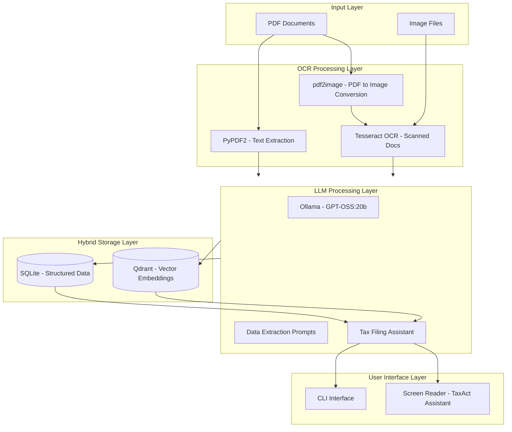
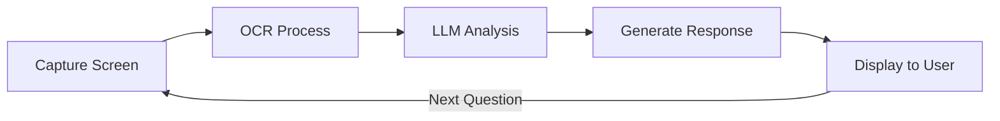

# Tax Document OCR & Filing Assistant - Architecture Plan

## Project Overview

A Python-based system to:
1. OCR tax documents (W2, 1099-INT, 1099-DIV)
2. Extract and store structured tax data
3. Use a local LLM (Ollama) to parse values and assist with tax filing
4. Provide real-time assistance when using TaxAct web software

---

## System Architecture



---

## Project Structure

```
do_my_taxes/
|-- config/
|   |-- settings.yaml           # Configuration file for paths, model names, etc.
|   |-- tax_schemas.yaml        # Field definitions for each tax form type
|
|-- src/
|   |-- __init__.py
|   |
|   |-- ocr/
|   |   |-- __init__.py
|   |   |-- pdf_processor.py    # Extract text from digital PDFs
|   |   |-- image_ocr.py        # OCR for scanned docs/images
|   |   |-- document_classifier.py  # Identify document type - W2, 1099, etc.
|   |
|   |-- extraction/
|   |   |-- __init__.py
|   |   |-- llm_extractor.py    # LLM-based data extraction
|   |   |-- prompts.py          # Prompt templates for each form type
|   |   |-- validators.py      # Validate extracted data
|   |
|   |-- storage/
|   |   |-- __init__.py
|   |   |-- sqlite_handler.py   # SQLite CRUD operations
|   |   |-- qdrant_handler.py   # Vector DB operations
|   |   |-- models.py           # Data models/schemas
|   |
|   |-- assistant/
|   |   |-- __init__.py
|   |   |-- tax_assistant.py    # Main LLM assistant logic
|   |   |-- screen_reader.py    # Screen capture for TaxAct
|   |   |-- form_mapper.py      # Map extracted data to tax forms
|   |
|   |-- utils/
|   |   |-- __init__.py
|   |   |-- file_utils.py       # File handling utilities
|   |   |-- logger.py           # Logging configuration
|   |
|   |-- cli.py                  # Command-line interface
|   |-- main.py                 # Main entry point
|
|-- data/
|   |-- raw_documents/          # Input tax documents
|   |-- processed/              # Processed/OCRed documents
|   |-- exports/                # Exported data files
|
|-- db/
|   |-- taxes.db                # SQLite database file
|
|-- tests/
|   |-- __init__.py
|   |-- test_ocr.py
|   |-- test_extraction.py
|   |-- test_storage.py
|
|-- requirements.txt
|-- README.md
```

---

## Component Details

### 1. OCR Processing Layer

#### Purpose
Convert tax documents (PDFs and images) into machine-readable text.

#### Components

| Component | Technology | Purpose |
|-----------|------------|---------|
| `pdf_processor.py` | PyPDF2, pdfplumber | Extract embedded text from digital PDFs |
| `image_ocr.py` | Tesseract, pytesseract, pdf2image | OCR for scanned documents and images |
| `document_classifier.py` | LLM-based classification | Identify document type - W2 vs 1099-INT vs 1099-DIV |

#### Processing Flow
1. Input document arrives in `data/raw_documents/`
2. Attempt digital text extraction first (faster, more accurate)
3. If no text found, convert to image and run Tesseract OCR
4. Classify document type using LLM
5. Route to appropriate extraction pipeline

---

### 2. Data Extraction Layer

#### Purpose
Use LLM to extract structured data from OCR'd text.

#### Tax Form Schemas

##### W-2 Form Fields
```yaml
w2_fields:
  - box_a: employee_ssn
  - box_b: employer_ein
  - box_c: employer_name_address
  - box_d: control_number
  - box_e: employee_name
  - box_f: employee_address
  - box_1: wages_tips_compensation
  - box_2: federal_income_tax_withheld
  - box_3: social_security_wages
  - box_4: social_security_tax_withheld
  - box_5: medicare_wages
  - box_6: medicare_tax_withheld
  - box_7: social_security_tips
  - box_8: allocated_tips
  - box_9: blank
  - box_10: dependent_care_benefits
  - box_11: nonqualified_plans
  - box_12: codes_and_amounts  # Complex - multiple codes
  - box_13: checkboxes  # Statutory employee, retirement plan, third-party sick pay
  - box_14: other  # Various employer-specific items
  - box_15: state_employer_state_id
  - box_16: state_wages_tips
  - box_17: state_income_tax
  - box_18: local_wages_tips
  - box_19: local_income_tax
  - box_20: locality_name
```

##### 1099-INT Form Fields
```yaml
1099_int_fields:
  - payer_name: payer_info
  - payer_tin: payer_tin
  - recipient_tin: recipient_ssn
  - box_1: interest_income
  - box_2: early_withdrawal_penalty
  - box_3: interest_on_us_savings_bonds
  - box_4: federal_income_tax_withheld
  - box_5: investment_expenses
  - box_6: foreign_tax_paid
  - box_7: foreign_country
  - box_8: tax_exempt_interest
  - box_9: specified_private_activity_bond_interest
  - box_10: market_discount
  - box_11: bond_premium
  - box_12: bond_premium_treasury_obligations
  - box_13: bond_premium_tax_exempt_bond
  - box_14: tax_exempt_cusip_number
  - box_15: state_info
```

##### 1099-DIV Form Fields
```yaml
1099_div_fields:
  - payer_name: payer_info
  - payer_tin: payer_tin
  - recipient_tin: recipient_ssn
  - box_1a: total_ordinary_dividends
  - box_1b: qualified_dividends
  - box_2a: total_capital_gain
  - box_2b: unrecaptured_section_1250_gain
  - box_2c: section_1202_gain
  - box_2d: collectibles_gain
  - box_2e: section_897_ordinary_dividends
  - box_2f: section_897_capital_gain
  - box_3: nondividend_distributions
  - box_4: federal_income_tax_withheld
  - box_5: section_199a_dividends
  - box_6: investment_expenses
  - box_7: foreign_tax_paid
  - box_8: foreign_country
  - box_9: cash_liquidation
  - box_10: noncash_liquidation
  - box_11: fatca_filing
  - box_12: state_info
```

#### LLM Extraction Strategy
- Use structured prompts with JSON output format
- Include field descriptions in prompts for accuracy
- Implement validation layer to check extracted values
- Handle multi-page documents and multiple instances of same form type

---

### 3. Hybrid Storage Layer

#### SQLite - Structured Data Storage

**Purpose**: Store extracted key-value pairs for reliable querying and reporting.

**Schema Design**:
```sql
-- Tax years table
CREATE TABLE tax_years (
    id INTEGER PRIMARY KEY,
    year INTEGER UNIQUE NOT NULL,
    filing_status TEXT,
    created_at TIMESTAMP DEFAULT CURRENT_TIMESTAMP
);

-- Documents table
CREATE TABLE documents (
    id INTEGER PRIMARY KEY,
    tax_year_id INTEGER REFERENCES tax_years(id),
    document_type TEXT NOT NULL,  -- W2, 1099_INT, 1099_DIV
    file_name TEXT,
    file_hash TEXT,
    ocr_text TEXT,
    processing_status TEXT,
    created_at TIMESTAMP DEFAULT CURRENT_TIMESTAMP
);

-- W2 data table
CREATE TABLE w2_data (
    id INTEGER PRIMARY KEY,
    document_id INTEGER REFERENCES documents(id),
    employer_ein TEXT,
    employer_name TEXT,
    employer_address TEXT,
    employee_name TEXT,
    employee_ssn TEXT,
    wages DECIMAL(12,2),
    federal_tax_withheld DECIMAL(12,2),
    social_security_wages DECIMAL(12,2),
    social_security_tax_withheld DECIMAL(12,2),
    medicare_wages DECIMAL(12,2),
    medicare_tax_withheld DECIMAL(12,2),
    state_wages DECIMAL(12,2),
    state_tax_withheld DECIMAL(12,2),
    state_code TEXT,
    box_12_codes TEXT,  -- JSON string
    box_14_other TEXT,  -- JSON string
    raw_data TEXT,  -- Full JSON of all extracted fields
    created_at TIMESTAMP DEFAULT CURRENT_TIMESTAMP
);

-- 1099-INT data table
CREATE TABLE form_1099_int (
    id INTEGER PRIMARY KEY,
    document_id INTEGER REFERENCES documents(id),
    payer_name TEXT,
    payer_tin TEXT,
    recipient_tin TEXT,
    interest_income DECIMAL(12,2),
    federal_tax_withheld DECIMAL(12,2),
    foreign_tax_paid DECIMAL(12,2),
    tax_exempt_interest DECIMAL(12,2),
    raw_data TEXT,
    created_at TIMESTAMP DEFAULT CURRENT_TIMESTAMP
);

-- 1099-DIV data table
CREATE TABLE form_1099_div (
    id INTEGER PRIMARY KEY,
    document_id INTEGER REFERENCES documents(id),
    payer_name TEXT,
    payer_tin TEXT,
    recipient_tin TEXT,
    total_ordinary_dividends DECIMAL(12,2),
    qualified_dividends DECIMAL(12,2),
    total_capital_gain DECIMAL(12,2),
    federal_tax_withheld DECIMAL(12,2),
    foreign_tax_paid DECIMAL(12,2),
    raw_data TEXT,
    created_at TIMESTAMP DEFAULT CURRENT_TIMESTAMP
);
```

#### Qdrant - Vector Embeddings Storage

**Purpose**: Enable semantic search and RAG queries over document content.

**Configuration**:
- Collection name: `tax_documents`
- Vector size: Depends on embedding model (e.g., 1536 for OpenAI embeddings, or use local embedding model)
- Distance metric: Cosine similarity

**Document Structure**:
```python
{
    "id": "doc_uuid",
    "vector": [0.1, 0.2, ...],  # Embedding vector
    "payload": {
        "document_type": "W2",
        "tax_year": 2025,
        "employer_name": "Acme Corp",
        "source_file": "w2_acme.pdf",
        "ocr_text": "full ocr text...",
        "extracted_fields": {
            "wages": 75000.00,
            "federal_tax_withheld": 8500.00
        }
    }
}
```

**Use Cases**:
- "Show me all documents from Acme Corp"
- "What was my total interest income?"
- "Find documents with foreign tax paid"
- RAG context for LLM assistant

---

### 4. LLM Assistant Layer

#### Ollama Integration

**Configuration**:
```yaml
ollama:
  base_url: http://localhost:11434
  model: gpt-oss:20b
  options:
    temperature: 0.1  # Low for factual extraction
    num_ctx: 8192     # Context window
```

**API Integration**:
```python
# Using ollama Python library
import ollama

response = ollama.chat(
    model='gpt-oss:20b',
    messages=[
        {'role': 'system', 'content': EXTRACTION_PROMPT},
        {'role': 'user', 'content': ocr_text}
    ],
    format='json'  # Structured output
)
```

#### Prompt Templates

**Document Classification Prompt**:
```
You are a tax document classifier. Analyze the following text and identify the document type.

Possible types: W2, 1099_INT, 1099_DIV, 1099_B, 1099_NEC, 1098, OTHER

Text:
{ocr_text}

Respond with JSON: {"document_type": "TYPE", "confidence": 0.95}
```

**W2 Extraction Prompt**:
```
You are a tax data extraction specialist. Extract all fields from this W-2 form.

Text from W-2 form:
{ocr_text}

Extract the following fields and respond in JSON format:
{
    "employer_ein": "XX-XXXXXXX",
    "employer_name": "Company Name",
    "employer_address": "Street, City, State ZIP",
    "employee_name": "First Last",
    "employee_ssn": "XXX-XX-XXXX",
    "wages": 0.00,
    "federal_tax_withheld": 0.00,
    "social_security_wages": 0.00,
    "social_security_tax_withheld": 0.00,
    "medicare_wages": 0.00,
    "medicare_tax_withheld": 0.00,
    "state_wages": 0.00,
    "state_tax_withheld": 0.00,
    "state_code": "CA",
    "box_12_codes": [{"code": "D", "amount": 5000.00}],
    "box_14_other": [{"description": "CA SDI", "amount": 150.00}]
}

If a field is not present, use null. Be precise with numbers.
```

---

### 5. TaxAct Assistant - Screen Reading

#### Purpose
Provide real-time assistance while using TaxAct web application.

#### Implementation Options

| Option | Technology | Pros | Cons |
|--------|------------|------|------|
| Screenshot + OCR | mss, PIL, Tesseract | Simple, works with any app | Not real-time |
| Browser Automation | Selenium, Playwright | Can interact with page | Complex, may break |
| Accessibility APIs | pywinauto, pyautogui | More reliable | Platform-specific |

#### Recommended Approach: Screenshot + OCR + LLM



**Workflow**:
1. User captures screenshot of TaxAct screen (hotkey or button)
2. OCR extracts text from screenshot
3. LLM analyzes current form/question
4. LLM retrieves relevant data from SQLite/Qdrant
5. LLM provides answer and explanation
6. User enters data manually (for security)

**Security Note**: The assistant should NOT auto-fill forms. It should provide guidance and values for manual entry.

---

## Implementation Roadmap

### Phase 1: Foundation
- [ ] Set up project structure
- [ ] Create configuration files
- [ ] Implement logging and utilities
- [ ] Set up SQLite database with schema
- [ ] Install and configure Qdrant (Docker or local)

### Phase 2: OCR Pipeline
- [ ] Implement PDF text extraction
- [ ] Implement image OCR with Tesseract
- [ ] Create document classifier
- [ ] Build document processing pipeline

### Phase 3: LLM Integration
- [ ] Set up Ollama connection
- [ ] Create extraction prompts for each form type
- [ ] Implement structured JSON output parsing
- [ ] Build validation layer

### Phase 4: Storage Layer
- [ ] Implement SQLite CRUD operations
- [ ] Implement Qdrant vector storage
- [ ] Create data models
- [ ] Build query interfaces

### Phase 5: CLI Interface
- [ ] Create command-line interface
- [ ] Implement document processing commands
- [ ] Add query and export commands
- [ ] Build summary/report generation

### Phase 6: TaxAct Assistant
- [ ] Implement screen capture
- [ ] Build screenshot OCR pipeline
- [ ] Create assistant prompts
- [ ] Build interactive assistant mode

### Phase 7: Testing & Polish
- [ ] Write unit tests
- [ ] Integration testing
- [ ] Error handling and edge cases
- [ ] Documentation

---

## Dependencies

```txt
# requirements.txt

# OCR
PyPDF2>=3.0.0
pdfplumber>=0.10.0
pytesseract>=0.5.10
pdf2image>=1.16.0
Pillow>=10.0.0

# LLM
ollama>=0.1.0

# Storage
sqlite3  # Built-in
qdrant-client>=1.7.0

# Configuration
pyyaml>=6.0
python-dotenv>=1.0.0

# Screen Capture
mss>=9.0.0
pyautogui>=0.9.54

# CLI
click>=8.1.0
rich>=13.0.0  # Pretty terminal output

# Utilities
pydantic>=2.0.0  # Data validation

# Testing
pytest>=7.4.0
pytest-cov>=4.1.0
```

---

## Security Considerations

1. **Sensitive Data**: Tax documents contain SSNs, EINs, and financial data
   - Store configuration file securely (not in git if contains sensitive values)
   - Consider encrypting the SQLite database
   - Never log sensitive field values

2. **LLM Privacy**: Using local Ollama ensures data stays on your machine
   - No data sent to external APIs
   - Model runs entirely locally

3. **File Storage**: 
   - Raw documents should be in a secure location
   - Consider encrypting at rest
   - Clean up temporary files

---

## Configuration Example

```yaml
# config/settings.yaml

project:
  name: "Tax Document Processor"
  version: "1.0.0"

paths:
  raw_documents: "data/raw_documents"
  processed: "data/processed"
  exports: "data/exports"
  database: "db/taxes.db"

ocr:
  tesseract_path: null  # Auto-detect or set explicitly
  languages: ["eng"]
  dpi: 300

llm:
  provider: "ollama"
  ollama:
    base_url: "http://localhost:11434"
    model: "gpt-oss:20b"
    extraction_options:
      temperature: 0.1
      num_ctx: 8192
    assistant_options:
      temperature: 0.3
      num_ctx: 16384

storage:
  sqlite:
    database: "db/taxes.db"
  qdrant:
    host: "localhost"
    port: 6333
    collection: "tax_documents"
    embedding_model: "local"  # or specify model

screen_assistant:
  capture_hotkey: "ctrl+shift+s"
  ocr_language: "eng"
```

---

## CLI Commands Design

```bash
# Process documents
python -m src.main process --input data/raw_documents/ --year 2025

# List processed documents
python -m src.main list --year 2025 --type W2

# Query extracted data
python -m src.main query "total wages" --year 2025

# Export data
python -m src.main export --year 2025 --format json --output data/exports/tax_2025.json

# Generate summary
python -m src.main summary --year 2025

# Start TaxAct assistant mode
python -m src.main assist --year 2025

# Verify Ollama connection
python -m src.main check-llm
```

---

## Next Steps

1. Review this architecture plan
2. Confirm or adjust any components
3. Switch to Code mode to begin implementation
4. Start with Phase 1: Foundation setup